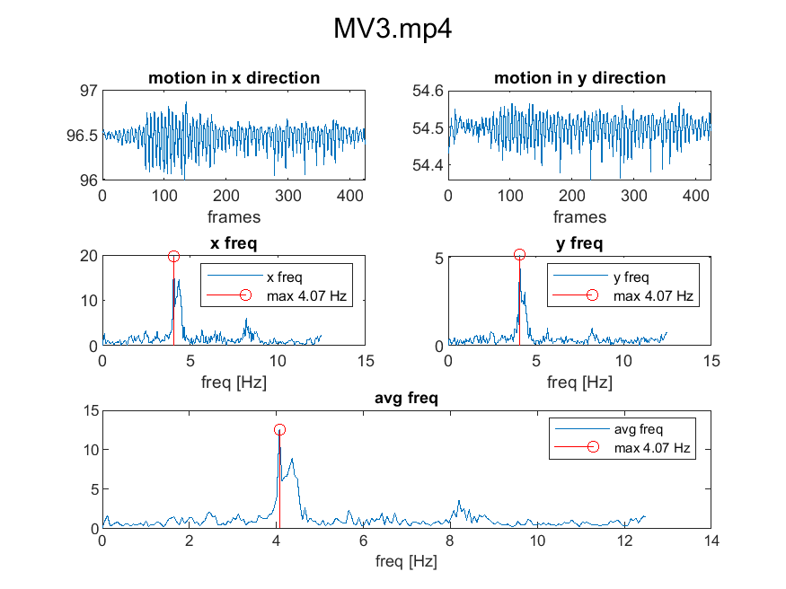

# TremAn Algorithms

Algorithms for TremAn app

## Center of motion algorithm

1. Convert frames to gray
2. Compute difference between frames
3. Normalize differences frames (df) from 0 to 1 (here using [mat2gray](https://www.mathworks.com/help/images/ref/mat2gray.html) function)
4. Compute center of motion (something like center of mass, but with normalized df) for X and Y coordinates.

   `centerOfMotionX = mean(A(:) .* X(:)) / meanA;`
   
   where `X` are x coordinates of all pixels in `A` (df).
5. Store this centerOfMotion for every frame.
6. Compute amplitude spectrum using fft for x and y.
7. Get max frequency from average (x and y) spectrum.

### Results for testset radim01

- sizeReductionFactor = 0.1 (algorithm works with 1/10 of original resolution)
- works same with sizeReductionFactor = 0.01 

video | real freq [Hz] (counting swings) | freq from acc [Hz]|result freq [Hz] (algorithm)
---------|----------|---------|-------
MV1.mp4 | 12 sw/5 s = 2.4     | 0* | 2.36  
MV2.mp4 | 40 sw/14 s = 2.86   | 2.86 | 2.87  
MV3.mp4 | 70 sw/17 s = 4.12   | 4.06 | 4.07  
MV4.mp4 | 90 sw/16 s = 5.625  | 5.48 | 5.63  
MV5.mp4 | 93 sw/16.5 s = 5.64 | 5.56 | 5.57  
MV6.mp4 | 45 sw/17.3 s = 2.54 | 2.52 | 2.61  

*data are too short and signal is too low, probably does not fit the video.

#### results for COM algorithm

### Current limitations

- Doesn't work for chessboard videos (difference is too sharp )

